# ip-router

**语言 / Language：** [中文](#中文说明) · [English](#english)

## 文档索引 / Documentation Index

### 中文

- [项目介绍](#zh-overview)
- [总体架构](#zh-architecture)
- [核心组件与路由数据模型](#zh-components)
- [DNS 查询与自动路由流程](#zh-dns-flow)
- [路由添加流程](#zh-route-flow)
- [TTL、共享引用与自动清理](#zh-ttl)
- [持久化与启动恢复](#zh-persistence)
- [服务路由与系统路由](#zh-route-types)
- [完整业务闭环](#zh-end-to-end)
- [平台实现](#zh-platform)
- [Web 管理功能](#zh-web-features)
- [代码结构](#zh-source-layout)
- [安装教程](#zh-install)
  - [安装 acl-master](#zh-install-acl-master)
  - [安装后使用 Web 管理界面](#zh-use-web-console)
- [HTTP 接口与使用说明](#zh-usage)
- [dns-gate GeoIP 自动路由](#zh-geoip)
- [参与贡献](#zh-contributing)

### English

- [Overview](#en-overview)
- [Architecture](#en-architecture)
- [Components and route data model](#en-components)
- [DNS and automatic routing flow](#en-dns-flow)
- [Route creation flow](#en-route-flow)
- [TTL and shared references](#en-ttl)
- [Persistence and startup recovery](#en-persistence)
- [Managed routes versus system routes](#en-route-types)
- [End-to-end flow](#en-end-to-end)
- [Platform implementation](#en-platform)
- [Web console](#en-web-features)
- [Source layout](#en-source-layout)
- [Installation](#en-install)
  - [Install acl-master](#en-install-acl-master)
  - [Using the web console after installation](#en-use-web-console)
- [HTTP API](#en-http-api)
- [macOS resolver management](#en-resolver)
- [Persistence configuration](#en-persistence-config)
- [GeoIP configuration and database updates](#en-geoip)
- [Contributing](#en-contributing)

<a id="中文说明"></a>

# 中文说明

<a id="zh-overview"></a>

## 项目介绍

本项目是一套“按域名解析结果动态分流”的 DNS 与 IP 路由管理系统，由
`dns-gate` 和 `ip-router` 两个服务组成：

- `dns-gate` 代理客户端 DNS 查询，将请求转发给真正的上游 DNS；收到响应后，
  使用 DB-IP Country Lite 判断解析所得 IPv4 地址的国家或地区。
- `ip-router` 接收域名（字符串 KEY）、目标 IP、网关和 TTL，调用操作系统 API
  添加或删除静态主机路由，并提供持久化、过期清理及 Web 管理界面。
- macOS 的 `/etc/resolver` 决定哪些域名后缀由 `dns-gate` 解析；未被接管的域名
  仍由系统或 VPN 的 DNS 处理。
- `acl-master` 负责两个服务的启动、停止及运行管理。

最终的数据分流并不是由 DNS 服务直接完成的：DNS 负责发现域名对应的 IP，
`ip-router` 再为命中目标国家的 IP 写入 `/32` 静态路由，使后续网络连接通过
指定网关发送。

<a id="zh-architecture"></a>

## 总体架构

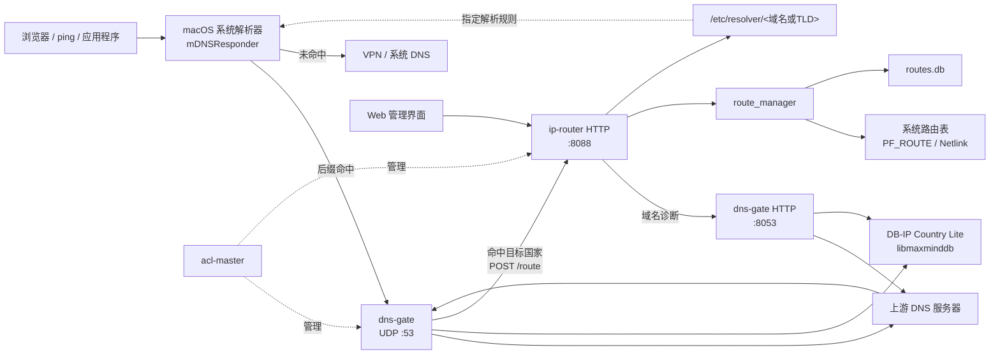

<a id="zh-components"></a>

## 核心组件

### dns-gate

`dns-gate` 基于 ACL 的 `master_udp` 实现 UDP DNS 代理。它使用
`acl::rfc1035_request` 解析客户端查询，向配置的上游 DNS 转发原始协议包，
再使用 `acl::rfc1035_response` 解析并校验上游响应。

收到有效响应后，服务提取 A 记录，通过内置的 `libmaxminddb` 查询 DB-IP
国家库。属于 `geoip_countries` 配置国家的地址会被合并为一次批量请求，发送至
`ip-router`：

```text
POST /route?key=<查询域名>&ips=<IPv4列表>&gateway=<网关>&ttl=<秒>
```

该路由请求结束后，`dns-gate` 才把原始 DNS 响应返回客户端，以尽量保证客户端
开始连接目标 IP 时系统路由已经生效。GeoIP 查询或路由请求失败只会记录日志，
不会阻止 DNS 响应返回。目前国家判断和自动路由针对 IPv4 A 记录；DNS 代理本身
仍可转发其他查询类型。

`dns-gate` 还提供独立的 HTTP 协程服务，用于健康检查和只读的域名解析、国家
归属诊断。诊断接口使用与 UDP 服务相同的上游 DNS 和 MMDB 数据库，但不会添加
系统路由。

### ip-router

`ip-router` 基于 ACL 的 `master_fiber` 实现 HTTP 服务，主要负责：

- 以字符串 `key` 管理一对多的目标 IP；DNS 自动路由时通常以域名作为 KEY。
- 通过 macOS/FreeBSD 的 PF_ROUTE 或 Linux Netlink 添加、查询和删除 IPv4
  静态主机路由。
- 将服务管理的路由持久化到 `routes.db`，启动时恢复尚未过期的记录。
- 每秒检查 TTL，到期后在没有其他 KEY 引用该 IP 时删除系统路由。
- 管理 macOS `/etc/resolver`，实现指定域名或顶级域名的 DNS 接管。
- 提供中英文 Web 控制台、全局网关设置、列表查询、排序、分页、批量操作和
  域名国家诊断。

### 路由数据模型

一条服务路由包含 KEY、目标 IPv4、网关、TTL、绝对过期时间和最后操作信息。
一个 KEY 可以包含多个 IP，同一个 IP 也可以被多个 KEY 引用：

```text
KEY（通常为域名）
 ├── IP 1 -> gateway、ttl、expires_at
 ├── IP 2 -> gateway、ttl、expires_at
 └── IP 3 -> gateway、ttl、expires_at
```

`ttl <= 0` 表示永久路由，`ttl > 0` 表示经过指定秒数后自动删除。系统中实际
添加的是目标 IP 的 `/32` IPv4 主机路由。

<a id="zh-dns-flow"></a>

## DNS 查询与自动路由流程

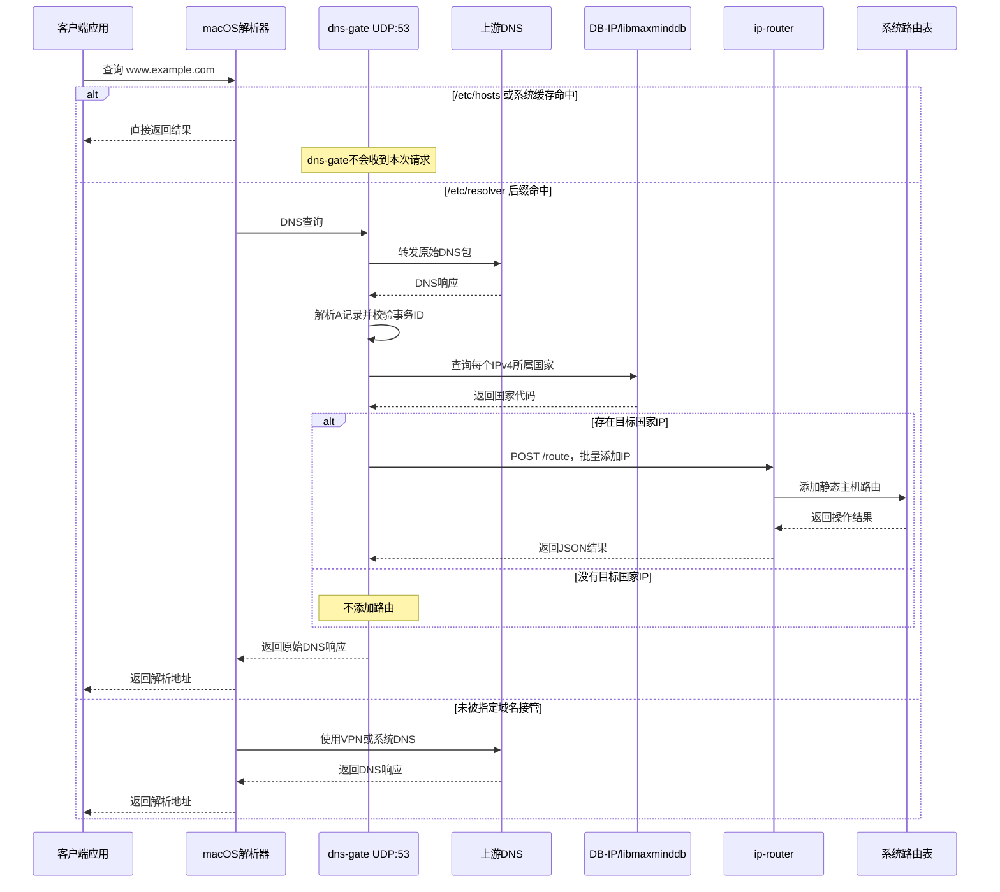

`/etc/hosts` 的优先级高于 `/etc/resolver`，系统 DNS 缓存也可能直接返回结果。
这两种情况下 `dns-gate` 收不到新的查询，因此不会触发本次动态路由添加。

<a id="zh-route-flow"></a>

## 路由添加流程

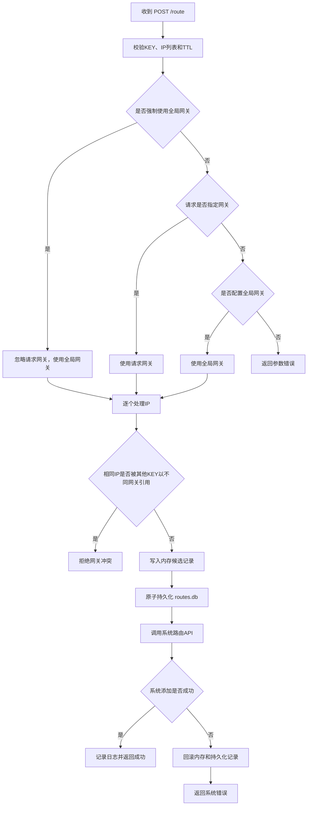

同一 KEY、IP 和网关的重复添加是幂等更新，会刷新 TTL。批量请求允许部分成功，
接口会分别返回每个 IP 的处理结果。

<a id="zh-ttl"></a>

## TTL、共享引用与自动清理

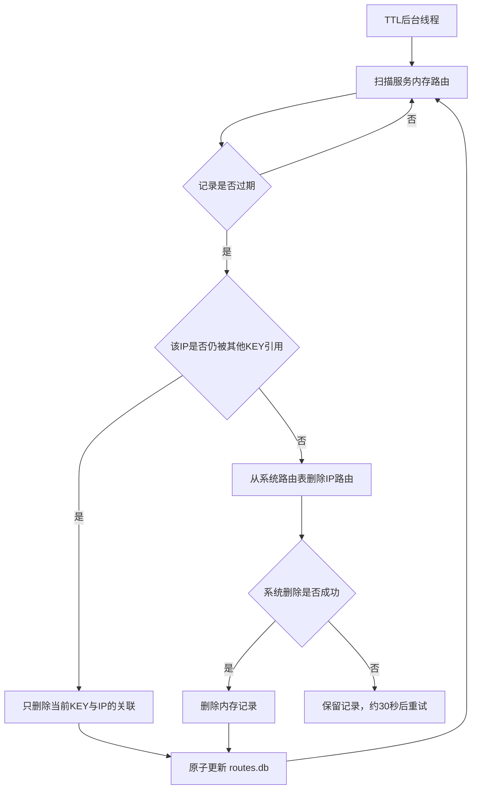

例如两个域名同时引用一个 IP 时，其中一个域名过期只会删除该 KEY 的引用；
最后一个引用消失后才会删除系统路由。手动按 KEY、IP 或 KEY+IP 删除服务路由
时，也会同步更新内存、系统路由和持久化文件。

<a id="zh-persistence"></a>

## 持久化与启动恢复

服务路由以制表符分隔形式保存在 `routes_file` 中，更新时采用临时文件加
`rename` 的原子替换方式。启动时会校验记录、清理已过期项目、恢复有效的系统
路由，再重建内存索引。恢复系统路由失败的记录会保留在磁盘，供下次启动继续
尝试。

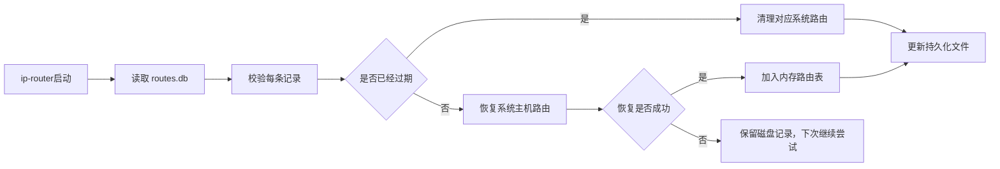

<a id="zh-route-types"></a>

## 服务路由与系统路由

Web 界面中的两个路由列表来源不同：

| 列表 | 数据来源 | 是否有 KEY | 内容范围 |
| --- | --- | --- | --- |
| 服务内存路由 | `route_manager` 内存及 `routes.db` | 有 | 由 ip-router 管理的路由 |
| 系统静态路由 | 操作系统内核路由表 | 通常没有 | ip-router、VPN、手工命令及其他软件添加的路由 |

内核路由表不保存域名、KEY 或创建者。系统静态路由页面点击 IP 所做的“域名反查”
只是用该 IP 查询当前服务路由；没有匹配 KEY 并不表示路由异常，它可能由 OpenVPN
或其他网络软件创建。例如 VPN 通常会为 VPN 服务器公网 IP 添加一条经物理网关
直连的路由，以防止隧道递归，这类路由不应由 ip-router 的 TTL 线程自动删除。

<a id="zh-end-to-end"></a>

## 完整业务闭环

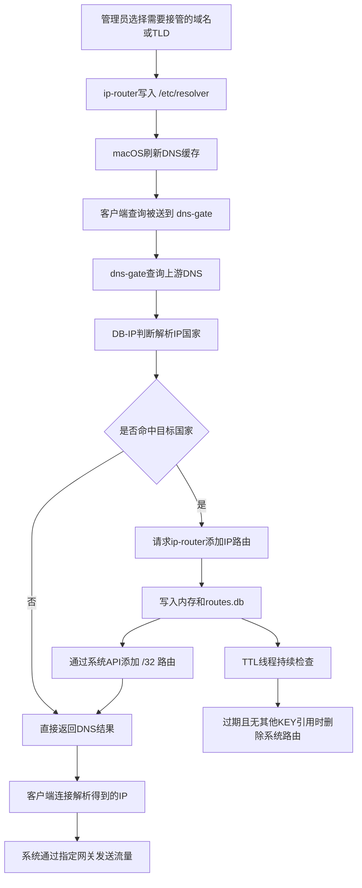

<a id="zh-platform"></a>

## 平台实现

| 平台 | 添加和删除路由 | 枚举系统路由 |
| --- | --- | --- |
| macOS / FreeBSD | PF_ROUTE 路由套接字 | `sysctl NET_RT_DUMP` |
| Ubuntu / Linux | Netlink `RTM_NEWROUTE`、`RTM_DELROUTE` | Netlink dump |

<a id="zh-web-features"></a>

## Web 管理功能

管理页面采用左侧导航、右侧工作区布局，支持中文和英文，并在每次切换功能页时
重新向服务端获取数据。主要功能如下：

- **路由操作**：按 KEY 添加一个或多个 IP，设置网关和 TTL；可按 KEY、IP 或
  KEY+IP 删除；可以设置默认全局网关及可选的强制覆盖模式。
- **指定域名 DNS**：批量添加、查询、排序和删除 `/etc/resolver` 域名规则，
  支持模糊搜索。
- **全局 DNS 接管**：显示 IANA 顶级域名列表，将 `com`、`net`、`cn`、`ai`、
  `io` 等常用 TLD 单独展示，支持批量添加和删除。
- **域名归属诊断**：通过 dns-gate 解析输入域名，显示 A 记录、CNAME、国家代码、
  是否命中目标国家以及按当前配置是否会自动添加路由。
- **服务内存路由**：按根域名折叠，支持展开查看多个 IP、模糊查询、KEY/过期时间
  排序、10/20/50/100 分页、浏览器 TTL 倒计时和批量删除缓存路由。所有根域名
  都可以被勾选；批量写入 resolver 时由服务端跳过已经存在的配置。
- **系统静态路由**：直接读取内核路由表，支持模糊查询、分页、单条或多选批量
  删除；点击 IP 可以反查当前服务路由中引用该 IP 的域名或 KEY。

服务内存路由按照可注册根域名合并展示，例如 `www.iqiyi.com` 和
`ipv6-static.dns.iqiyi.com` 会折叠到 `iqiyi.com`。当前实现使用内置的常见复合
后缀规则，并不是完整的 Public Suffix List。

<a id="zh-source-layout"></a>

## 代码结构

```text
.
├── dns-gate/
│   ├── dgate_service.cpp           # UDP DNS代理
│   ├── geoip_router.cpp            # MMDB查询和自动路由请求
│   ├── dns_http_service.cpp        # HTTP诊断服务
│   ├── master_service.cpp          # ACL主服务及配置初始化
│   ├── package/                    # macOS、Ubuntu安装包脚本
│   └── update-dbip.sh              # DB-IP数据库更新脚本
├── ip-router/
│   ├── route_manager.cpp           # 路由、持久化和TTL管理
│   ├── route_service.cpp           # HTTP路由接口
│   ├── domain_manager.cpp          # /etc/resolver管理
│   ├── master_service.cpp          # ACL HTTP主服务
│   ├── html/                       # Web页面及IANA TLD清单
│   ├── package/                    # macOS、Ubuntu安装包脚本
│   └── update-tlds.sh              # IANA TLD清单更新脚本
└── vendor/libmaxminddb/            # 内置libmaxminddb源码
```


<a id="zh-install"></a>

## 安装教程

项目在 `ip-router/package` 中提供平台原生安装包构建脚本。运行安装包前，
需要先将 acl-master 安装至 `/opt/soft/acl-master`。

<a id="zh-install-acl-master"></a>

### 安装 acl-master

先准备 C/C++ 编译环境和 Git。Ubuntu 可安装 `build-essential`，macOS 可通过
`xcode-select --install` 安装 Command Line Tools。然后从 ACL 官方仓库编译并
安装 master 框架：

```shell
git clone https://gitee.com/acl-dev/acl.git
cd acl
make
sudo make install_master
sudo touch /opt/soft/acl-master/conf/services.cf
```

安装完成后应至少存在以下两个程序：

```text
/opt/soft/acl-master/libexec/acl_master
/opt/soft/acl-master/bin/master_ctl
```

Ubuntu 使用 systemd 启动 acl-master：

```shell
sudo systemctl daemon-reload
sudo systemctl enable --now acl-master
sudo systemctl status acl-master --no-pager
```

macOS 可使用随 acl-master 安装的脚本启动和停止：

```shell
sudo /opt/soft/acl-master/sh/start.sh
sudo /opt/soft/acl-master/sh/stop.sh
```

acl-master 的主配置位于 `/opt/soft/acl-master/conf/main.cf`，其中
`service_file` 默认指向 `/opt/soft/acl-master/conf/services.cf`。安装
ip-router 和 dns-gate 时，安装脚本会把各自配置文件路径写入该服务清单，并通过
`master_ctl` 启动服务，因此通常不需要手工编辑 `services.cf`。

完成上述前置安装后，再构建并安装本项目。

macOS：

```shell
cd ip-router/package
./build-macos.sh
sudo installer -pkg ./dist/ip-router-1.0.0-macos-$(uname -m).pkg -target /
```

Ubuntu：

```shell
cd ip-router/package
./build-ubuntu.sh
sudo apt install ./dist/ip-router_1.0.0_$(dpkg --print-architecture).deb
```

dns-gate 使用对应目录下的脚本：

```shell
# macOS
cd dns-gate/package
./build-macos.sh

# Ubuntu
cd dns-gate/package
./build-ubuntu.sh
```

ip-router 和 dns-gate 的安装路径分别固定为 `/opt/soft/ip-router` 和
`/opt/soft/dns-gate`。安装程序会自动将服务加入
`/opt/soft/acl-master/conf/services.cf` 并启动服务。详细的版本、签名、
升级和构建参数参见两个模块各自的 `package/README.md`。

<a id="zh-use-web-console"></a>

### 安装后使用 Web 管理界面

建议先安装 ip-router，再安装 dns-gate。安装完成后可以检查两个 HTTP 服务：

```shell
curl http://127.0.0.1:8088/health
curl http://127.0.0.1:8053/health
```

如果服务没有运行，可以通过安装后的管理脚本重启：

```shell
sudo /opt/soft/ip-router/bin/ip-router-service restart
sudo /opt/soft/dns-gate/bin/dns-gate-service restart
```

在安装服务的计算机上打开浏览器，访问：

```text
http://127.0.0.1:8088/
```

首次使用建议按以下顺序配置：

1. 在 `/opt/soft/dns-gate/conf/dns-gate.cf` 中把 `ip_router_gateway` 设置为
   当前网络实际使用的网关，然后重启 dns-gate；该值为空时，dns-gate 不会触发
   GeoIP 自动路由。还可以在 Web 页的“路由操作”中设置 ip-router 默认全局网关；
   需要忽略客户端（包括 dns-gate）传入的网关时，再开启“强制使用全局路由”。
2. 打开“指定域名 DNS”，添加需要交给 dns-gate 解析的域名；如果希望按顶级
   域名批量接管，则使用“全局 DNS 接管”。该操作会在 macOS
   `/etc/resolver` 下创建受管文件并刷新系统 DNS 缓存。
3. 打开“域名归属诊断”，输入域名，确认上游解析地址、国家代码和“是否命中目标
   国家”符合预期。
4. 使用浏览器、`ping` 或 `dig` 发起真实 DNS 查询，然后在“服务内存路由”中
   查看域名和 IP，在“系统静态路由”中确认对应的 `/32` 路由已经生效。
5. 可以在“服务内存路由”中观察 TTL 倒计时、批量配置 resolver 或批量删除路由；
   “系统静态路由”还可显示 VPN 和其他程序创建的路由，删除前应确认其来源。

例如，可直接验证 DNS 和国家诊断接口：

```shell
dig @127.0.0.1 webcool.cn A
curl 'http://127.0.0.1:8088/dns-lookup?domain=webcool.cn'
```

默认配置只允许从本机访问 Web 界面。如果服务安装在远程主机上，建议使用 SSH
端口转发：

```shell
ssh -L 8088:127.0.0.1:8088 user@server
```

保持 SSH 会话打开，然后在本地浏览器访问 `http://127.0.0.1:8088/`。也可以把
`/opt/soft/ip-router/conf/ip-router.cf` 中的 `master_service` 改为实际监听地址
后重启 ip-router，但当前 Web 页面和 HTTP API 没有登录鉴权，不应直接暴露在
公网；应同时配置防火墙、反向代理和访问认证。

配置文件修改后使用相应的 `*-service restart` 命令生效。无法访问时，可检查：

```shell
tail -f /opt/soft/ip-router/var/log/ip-router.log
tail -f /opt/soft/dns-gate/var/log/dns-gate.log
```

<a id="zh-usage"></a>

## 使用说明

`ip-router` 提供以下 HTTP 接口（服务默认只监听本机地址）：

- `GET /health`：健康检查。
- `GET /`：显示路由与指定域名 DNS 分流管理页面。
- `GET /domains`：列出本服务管理的全部 DNS 分流域名。
- `GET /tlds`：列出随项目提供的 IANA 根区一级域名及清单版本。
- `POST /domain?domains=<域名列表>`：批量添加 DNS 分流域名，支持用逗号、分号或空白分隔，一次最多 4096 个。
- `DELETE /domain?domain=<域名>`：删除一个 DNS 分流域名；也可使用 `domains` 参数批量删除。
- `GET /routes`：以字符串 `key` 分组，列出本服务成功设置且尚未删除的全部 IP 路由。
- `GET /route-settings`：读取全局网关及强制使用状态。
- `POST /route-settings?gateway=<网关IPv4>&force=<布尔值>`：保存全局网关；`force` 可选，支持 `0/1`、`true/false`、`yes/no` 和 `on/off`。
- `DELETE /route-settings`：取消全局网关设置。
- `GET /system-routes`：直接读取系统路由表，列出静态 IPv4 主机路由及其网关和网络接口。
- `DELETE /system-route?ip=<目标IPv4>&gateway=<网关IPv4>`：直接删除指定的系统静态主机路由。
- `POST /route?ip=<目标IPv4>&gateway=<网关IPv4>&key=<字符串KEY>&ttl=<秒>`：向指定 KEY 添加或替换一个目标 IP 的主机路由。
- `POST /route?ips=<IPv4列表>&gateway=<网关IPv4>&key=<字符串KEY>&ttl=<秒>`：为同一 KEY 批量添加多个 IP，IP 之间用逗号、分号或空白分隔。
- `DELETE /route?key=<字符串KEY>`：删除指定 KEY 下的全部 IP 路由。
- `DELETE /route?ip=<目标IPv4>`：删除所有 KEY 下匹配该目标 IP 的路由。
- `DELETE /route?key=<字符串KEY>&ip=<目标IPv4>`：删除指定 KEY 下匹配该目标 IP 的路由。

参数 `target` 可作为 `ip` 的别名，参数 `route` 可作为 `gateway` 的别名。
旧的 `domain` 参数暂时可作为 `key` 的兼容别名。
`ttl` 为可选的整数秒数；缺省或小于等于 `0` 时永不过期，大于 `0` 时到期自动删除系统路由。
添加路由时，如果请求没有 `gateway`/`route` 参数，则使用已配置的全局网关；
开启全局网关的 `force` 后，即使请求指定了网关也会被全局网关覆盖。
全局网关设置持久化在路由数据库同目录的 `<routes_file>.global` 文件中，重启后自动加载。
修改系统路由表通常需要以 root 或具备相应网络管理权限的用户运行服务。

在 macOS 上，域名管理接口会为每个域名创建
`resolver_dir/<域名>`，使该域名及其全部子域名使用 dns-gate，其余域名继续使用
系统或 VPN 的默认 DNS。默认配置为：

```ini
resolver_dir = /etc/resolver
dns_gate_nameserver = 127.0.0.1
dns_gate_port = 53
dns_gate_http_addr = 127.0.0.1:8053
dns_gate_http_timeout = 8
resolver_search_order = 1
```

服务需要具备创建及删除 `resolver_dir` 中文件的权限，通常应以 root 运行。
接口只会更新或删除带有 `# managed by ip-router` 标记的文件；如果同名文件由
用户或其他软件创建，添加和删除操作都会拒绝执行，避免破坏已有 DNS 配置。

例如：

```shell
curl -X POST --data-urlencode $'domains=webcool.cn\nexample.com' \
  'http://127.0.0.1:8088/domain'
curl 'http://127.0.0.1:8088/domains'
curl -X DELETE 'http://127.0.0.1:8088/domain?domain=webcool.cn'
```

服务将内存路由持久化到配置项 `routes_file` 指定的文件。该配置留空或未设置时，默认使用程序当前运行目录下的 `routes.db`；既可填写绝对路径，也可填写相对于当前运行目录的路径（目标目录需已存在且可写）。启动时会恢复其中尚未过期的路由；添加、删除及 TTL 自动过期时会同步更新该文件。通过安装包部署时，文件位于 `/opt/soft/ip-router/conf/routes.db`。

根页面模板位于 `ip-router/html/index.html`。服务会在每次请求时读取模板，页面通过 `/routes` 接口加载数据，修改 HTML 后刷新即可生效。
管理页面采用左右分栏布局：左侧为固定功能导航，点击后在右侧切换并只显示
对应的功能区；窄屏设备会自动切换为顶部横向导航。
页面中的服务内存路由会先按可注册根域名合并显示；例如
`www.iqiyi.com` 和
`ipv6-static.dns.iqiyi.com` 会折叠在同一个 `iqiyi.com` 分组下。
服务内存路由表支持用复选框选择一个或多个根域名，并批量写入
`resolver_dir`。macOS 写入完成后会自动刷新 DNS 缓存并通知
`mDNSResponder` 重新加载配置；已经配置的根域名会在页面中标记为“已配置”。

“全局 DNS 接管”区域使用 IANA 官方根区 TLD 清单，可以搜索、选择部分
TLD，或一键将全部尚未配置的 TLD 写入 `resolver_dir`。这样可以让 dns-gate
接管所有公共 DNS 根区域名；私有后缀、单标签主机名以及 mDNS 名称不属于
IANA 根区，因此不在该功能覆盖范围内。当前清单位于
`ip-router/html/tlds-alpha-by-domain.txt`，更新方式：

```shell
cd ip-router
./update-tlds.sh
```

清单来源：<https://data.iana.org/TLD/tlds-alpha-by-domain.txt>。

<a id="zh-geoip"></a>

## dns-gate GeoIP 自动路由

`dns-gate` 集成了项目根目录 `vendor/libmaxminddb` 中的 libmaxminddb
1.13.3 源码，不依赖系统预装该库。收到上游 DNS 响应后，服务查询 A
记录对应的国家代码；命中 `geoip_countries` 时，会先调用 `ip-router` 的
批量添加接口，调用完成后再把原始 DNS 响应返回客户端。

DB-IP Country Lite 数据文件不包含在源码仓库中。可在 `dns-gate` 目录运行：

```shell
./update-dbip.sh
```

也可以指定输出路径和数据库月份：

```shell
./update-dbip.sh /var/lib/ip-router/dbip-country-lite.mmdb 2026-09
```

然后在 `dns-gate.cf` 中配置：

```ini
geoip_database = /var/lib/ip-router/dbip-country-lite.mmdb
geoip_countries = CN
http_addr = 127.0.0.1:8053
ip_router_addr = 127.0.0.1:8088
ip_router_gateway = 192.168.1.1
ip_router_timeout = 3
ip_router_ttl = 600
```

`geoip_countries` 支持用逗号、分号或空白分隔多个 ISO 3166-1 两位国家代码。
`ip_router_gateway` 必须按实际网络环境设置，留空时关闭 GeoIP 自动路由。
MMDB 查询或路由请求失败时服务会记录日志并继续返回 DNS 响应。[DB-IP Lite](https://db-ip.com/db/lite.php)
数据采用 CC BY 4.0 许可证，发布使用结果时需按其许可要求注明数据来源。

dns-gate 同时在 `http_addr` 提供只读诊断接口：

```shell
curl 'http://127.0.0.1:8053/lookup?domain=weibo.com'
```

接口使用与 UDP 代理相同的上游 DNS 和 GeoIP 数据库，返回 A 记录、CNAME、
国家代码以及每个 IP 是否命中 `geoip_countries`。诊断查询不会向 ip-router
添加路由。ip-router 的 `GET /dns-lookup?domain=<域名>` 会代理该接口，管理
页面左侧的“域名归属诊断”可直接展示结果。出于安全考虑，建议两个 HTTP
服务均只监听本机地址。

国家数据库加载状态与自动路由状态相互独立：即使未配置网关，诊断接口仍可
查询 IP 国家；只有 `geoip_countries`、`ip_router_addr` 和
`ip_router_gateway` 均有效时，自动路由状态才会显示为“已就绪”。

`GET /routes` 按字符串 KEY 分组返回：

```json
{
  "success": true,
  "count": 1,
  "routes": [
    {
      "key": "dns.google",
      "count": 2,
      "ips": [
        {"ip": "8.8.8.8", "gateway": "192.168.1.1", "ttl": 300, "expires_at": 1788574800},
        {"ip": "8.8.4.4", "gateway": "192.168.1.1", "ttl": 300, "expires_at": 1788574800}
      ]
    }
  ]
}
```

例如：

```shell
curl -X POST 'http://127.0.0.1:8088/route?ip=8.8.8.8&gateway=192.168.1.1&key=dns.google&ttl=300'
curl -X POST 'http://127.0.0.1:8088/route?ips=8.8.8.8,8.8.4.4&gateway=192.168.1.1&key=dns.google&ttl=300'
curl -X POST 'http://127.0.0.1:8088/route-settings?gateway=192.168.1.1&force=1'
curl -X POST 'http://127.0.0.1:8088/route?ip=8.8.8.8&key=dns.google&ttl=300'
curl -X DELETE 'http://127.0.0.1:8088/route-settings'
curl -X DELETE 'http://127.0.0.1:8088/route?key=dns.google'
curl -X DELETE 'http://127.0.0.1:8088/route?ip=8.8.8.8'
curl -X DELETE 'http://127.0.0.1:8088/route?key=dns.google&ip=8.8.8.8'
```

<a id="zh-contributing"></a>

## 参与贡献

1. Fork 本仓库。
2. 新建功能分支。
3. 提交代码修改。
4. 创建 Pull Request。

---

<a id="english"></a>

# English

<a id="en-overview"></a>

## Overview

This project provides domain-aware DNS and IP route management. It consists of
two services:

- `dns-gate` proxies client DNS queries to a real upstream DNS server and uses
  DB-IP Country Lite to identify the country or region of resolved IPv4
  addresses.
- `ip-router` accepts a string key, destination IP addresses, a gateway, and an
  optional TTL. It uses native operating-system APIs to manage static host
  routes and provides persistence, expiration cleanup, and a web console.
- On macOS, `/etc/resolver` determines which domain suffixes are resolved by
  `dns-gate`. Other domains continue to use the DNS supplied by the system or
  VPN.
- `acl-master` manages the startup, shutdown, and runtime of both services.

DNS itself does not route application traffic. It discovers the destination
addresses, after which `ip-router` installs `/32` routes for matching addresses
so subsequent connections use the configured gateway.

<a id="en-architecture"></a>

## Architecture

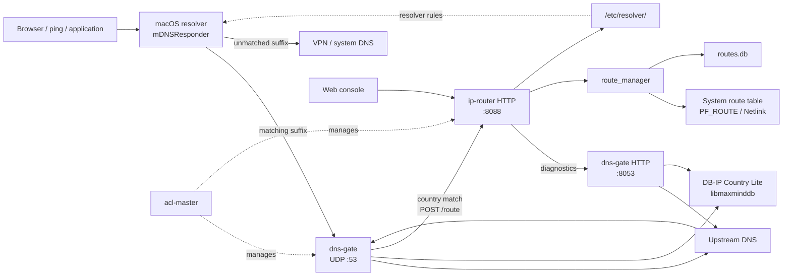

<a id="en-components"></a>

## Components

### dns-gate

`dns-gate` is a UDP DNS proxy built on ACL `master_udp`. It parses client
queries with `acl::rfc1035_request`, forwards the original wire-format packet
to the configured upstream DNS server, then parses and validates the response
with `acl::rfc1035_response`.

For a valid response, it extracts A records and queries the bundled DB-IP
database through `libmaxminddb`. Addresses whose country code is present in
`geoip_countries` are sent to `ip-router` in one batch:

```text
POST /route?key=<queried-domain>&ips=<IPv4-list>&gateway=<gateway>&ttl=<seconds>
```

`dns-gate` waits for that route request to finish before returning the original
DNS response, so the route will normally exist when the client starts its
connection. GeoIP or route-request failures are logged but do not prevent the
DNS response from being returned. Country matching and automatic routing
currently operate on IPv4 A records; other DNS query types are still proxied.

An independent fiber-based HTTP service supplies health checks and read-only
domain/country diagnostics. It uses the same upstream DNS server and MMDB
database as the UDP service, but diagnostic requests do not install routes.

### ip-router

`ip-router` is an HTTP service based on ACL `master_fiber`. It:

- Maps a string `key` to one or more destination addresses. `dns-gate`
  normally uses the queried domain as the key.
- Manages IPv4 static host routes through PF_ROUTE on macOS/FreeBSD and Netlink
  on Linux.
- Persists managed routes in `routes.db` and restores unexpired entries at
  startup.
- Checks TTL expiration every second and removes the system route when the
  expired address has no remaining key references.
- Manages macOS `/etc/resolver` files for per-domain or per-TLD DNS takeover.
- Provides a bilingual web console for settings, search, sorting, pagination,
  batch operations, and country diagnostics.

### Route data model

A managed entry contains a key, destination IPv4 address, gateway, TTL,
absolute expiration time, and operation metadata. One key can contain multiple
addresses, and multiple keys may reference the same address:

```text
KEY (normally a domain)
 ├── IP 1 -> gateway, ttl, expires_at
 ├── IP 2 -> gateway, ttl, expires_at
 └── IP 3 -> gateway, ttl, expires_at
```

`ttl <= 0` means no expiration. A positive TTL causes automatic removal after
the specified number of seconds. The actual system entry is an IPv4 `/32` host
route.

<a id="en-dns-flow"></a>

## DNS and automatic routing flow

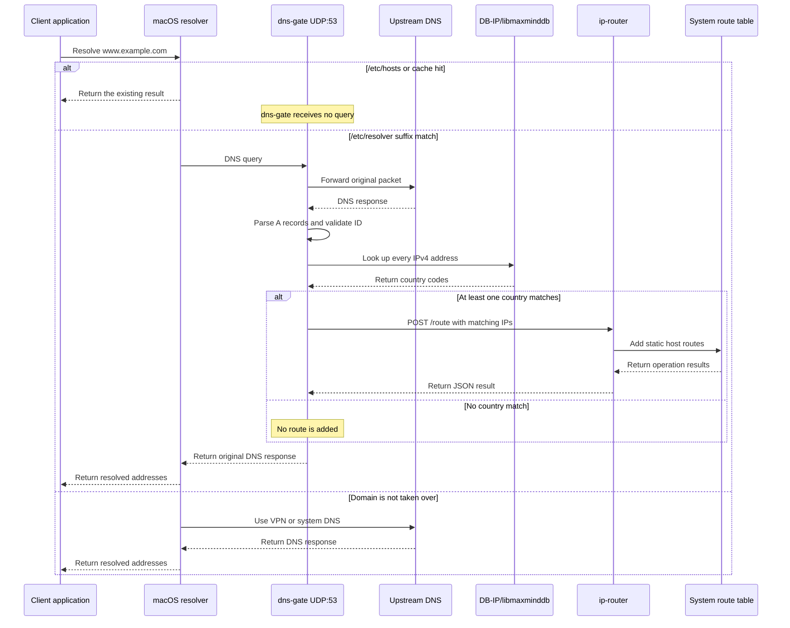

`/etc/hosts` has higher priority than `/etc/resolver`, and the system DNS cache
may also answer without a new lookup. In either case `dns-gate` receives no new
query and no new dynamic route is triggered.

<a id="en-route-flow"></a>

## Route creation flow

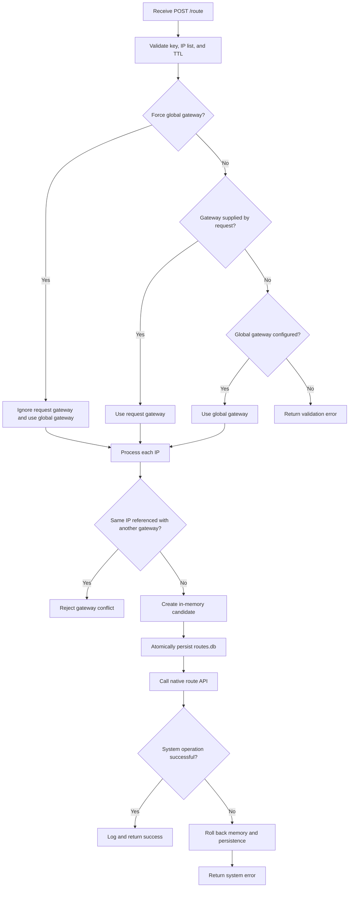

Adding the same key, IP, and gateway is idempotent and refreshes its TTL. Batch
requests may partially succeed and report a result for each address.

<a id="en-ttl"></a>

## TTL and shared references

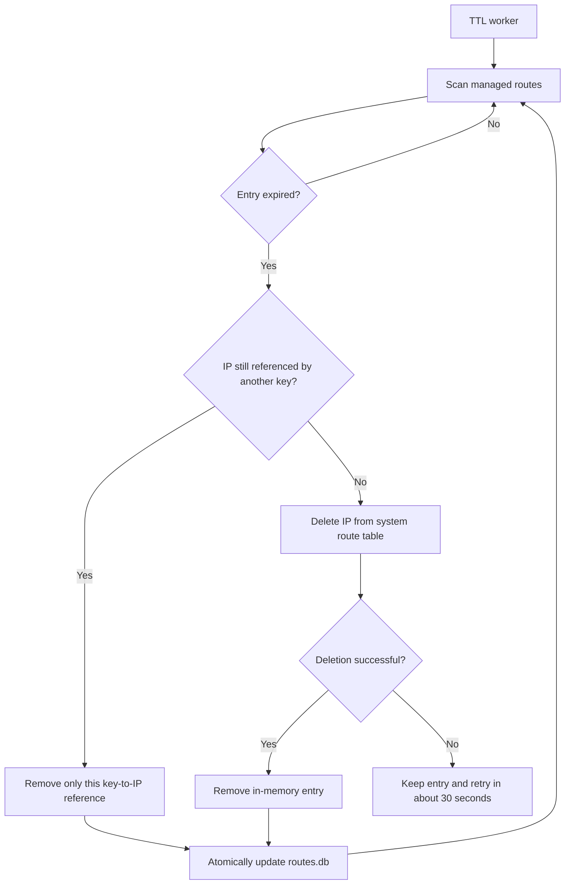

If two domains reference the same IP, expiration of one domain removes only its
reference. The system route is deleted only after the final reference is gone.
Manual deletion by key, IP, or key+IP also synchronizes managed memory,
persistence, and applicable system routes.

<a id="en-persistence"></a>

## Persistence and startup recovery

Managed routes are stored as tab-separated records in `routes_file`. Updates
use a temporary file followed by an atomic `rename`. At startup, `ip-router`
validates records, removes expired entries, restores active system routes, and
rebuilds its in-memory index. A record whose system route cannot be restored is
kept on disk so a later startup can retry it.

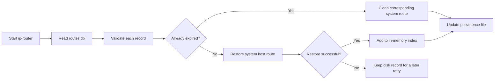

<a id="en-route-types"></a>

## Managed routes versus system routes

The two route lists in the web console have different sources:

| List | Source | Has a key | Scope |
| --- | --- | --- | --- |
| Managed routes | `route_manager` memory and `routes.db` | Yes | Routes owned by ip-router |
| System static routes | Kernel route table | Usually no | Routes from ip-router, VPNs, manual commands, and other software |

The kernel does not store domains, keys, or route ownership. Reverse lookup in
the system-route page only searches current ip-router records for the selected
IP. A route without a matching key may have been created by OpenVPN or another
program. VPN clients commonly add a physical-gateway route for the VPN server's
public IP to prevent tunnel recursion; the ip-router TTL worker must not delete
such external routes.

<a id="en-end-to-end"></a>

## End-to-end flow

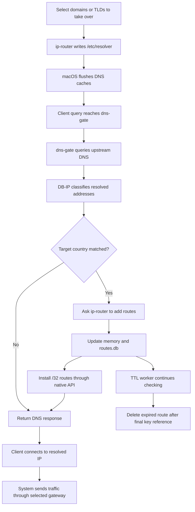

<a id="en-platform"></a>

## Platform implementation

| Platform | Add/delete routes | Enumerate system routes |
| --- | --- | --- |
| macOS / FreeBSD | PF_ROUTE socket | `sysctl NET_RT_DUMP` |
| Ubuntu / Linux | Netlink `RTM_NEWROUTE`, `RTM_DELROUTE` | Netlink dump |

<a id="en-web-features"></a>

## Web console

The bilingual web console uses a left navigation area and a right workspace.
Switching sections fetches fresh data from the server. It provides:

- **Route operations:** add one or more IPs under a key, set a gateway and TTL,
  delete by key/IP/key+IP, and configure an optional forced global gateway.
- **Domain-specific DNS:** batch add, search, sort, and delete managed
  `/etc/resolver` domain rules, including fuzzy search.
- **Global DNS takeover:** browse the IANA TLD list, access popular entries such
  as `com`, `net`, `cn`, `ai`, and `io`, and batch add or remove resolver files.
- **Country diagnostics:** resolve a domain through dns-gate and display A
  records, CNAMEs, country codes, country matches, and whether automatic routing
  would occur.
- **Managed routes:** group by registrable root domain, expand individual IPs,
  fuzzy-search and sort records, paginate at 10/20/50/100 items, count TTL down
  in the browser, add missing resolver files, and batch-delete cached routes.
  Every root-domain row remains selectable; the server skips resolver entries
  that already exist during batch creation.
- **System static routes:** read the kernel table directly, search and paginate,
  delete one or multiple routes, and click an IP to find current managed keys
  that reference it.

For example, `www.iqiyi.com` and `ipv6-static.dns.iqiyi.com` are grouped under
`iqiyi.com`. This currently uses a small built-in set of common compound
suffixes, not a complete Public Suffix List implementation.

<a id="en-source-layout"></a>

## Source layout

```text
.
├── dns-gate/
│   ├── dgate_service.cpp           # UDP DNS proxy
│   ├── geoip_router.cpp            # MMDB lookup and route requests
│   ├── dns_http_service.cpp        # HTTP diagnostic service
│   ├── master_service.cpp          # ACL service and configuration
│   ├── package/                    # macOS and Ubuntu packaging
│   └── update-dbip.sh              # DB-IP database updater
├── ip-router/
│   ├── route_manager.cpp           # Routes, persistence, and TTL
│   ├── route_service.cpp           # HTTP route API
│   ├── domain_manager.cpp          # /etc/resolver management
│   ├── master_service.cpp          # ACL HTTP master service
│   ├── html/                       # Web UI and IANA TLD list
│   ├── package/                    # macOS and Ubuntu packaging
│   └── update-tlds.sh              # IANA TLD updater
└── vendor/libmaxminddb/            # Bundled libmaxminddb source
```

<a id="en-install"></a>

## Installation

Install acl-master under `/opt/soft/acl-master` before installing either
service.

<a id="en-install-acl-master"></a>

### Install acl-master

Install a C/C++ toolchain and Git first. On Ubuntu, install `build-essential`;
on macOS, install the Command Line Tools with `xcode-select --install`. Then
build and install the master framework from the official ACL repository:

```shell
git clone https://gitee.com/acl-dev/acl.git
cd acl
make
sudo make install_master
sudo touch /opt/soft/acl-master/conf/services.cf
```

Verify that the installation provides at least these two executables:

```text
/opt/soft/acl-master/libexec/acl_master
/opt/soft/acl-master/bin/master_ctl
```

Start acl-master with systemd on Ubuntu:

```shell
sudo systemctl daemon-reload
sudo systemctl enable --now acl-master
sudo systemctl status acl-master --no-pager
```

On macOS, use the scripts installed with acl-master:

```shell
sudo /opt/soft/acl-master/sh/start.sh
sudo /opt/soft/acl-master/sh/stop.sh
```

The main configuration is `/opt/soft/acl-master/conf/main.cf`. Its
`service_file` setting points to
`/opt/soft/acl-master/conf/services.cf` by default. The ip-router and dns-gate
installers append their service configuration paths to this list and start the
services through `master_ctl`, so manual edits to `services.cf` are normally
unnecessary.

After this prerequisite is ready, build and install the services in this
repository.

macOS:

```shell
cd ip-router/package
./build-macos.sh
sudo installer -pkg ./dist/ip-router-1.0.0-macos-$(uname -m).pkg -target /

cd ../../dns-gate/package
./build-macos.sh
```

Ubuntu:

```shell
cd ip-router/package
./build-ubuntu.sh
sudo apt install ./dist/ip-router_1.0.0_$(dpkg --print-architecture).deb

cd ../../dns-gate/package
./build-ubuntu.sh
```

The packages install the services under `/opt/soft/ip-router` and
`/opt/soft/dns-gate`, register them in
`/opt/soft/acl-master/conf/services.cf`, and start them. See each module's
`package/README.md` for versioning, signing, upgrades, and build options.

<a id="en-use-web-console"></a>

### Using the web console after installation

Install ip-router before dns-gate. After installation, verify both HTTP
services:

```shell
curl http://127.0.0.1:8088/health
curl http://127.0.0.1:8053/health
```

If necessary, restart them with the installed service wrappers:

```shell
sudo /opt/soft/ip-router/bin/ip-router-service restart
sudo /opt/soft/dns-gate/bin/dns-gate-service restart
```

On the machine where the services are installed, open:

```text
http://127.0.0.1:8088/
```

For first-time setup, use the following order:

1. Set `ip_router_gateway` in `/opt/soft/dns-gate/conf/dns-gate.cf` to the
   actual gateway for the current network, then restart dns-gate. When this
   value is empty, dns-gate does not trigger GeoIP automatic routing. You may
   also set ip-router's default global gateway under **Route Operations**.
   Enable the force option only when gateways supplied by clients, including
   dns-gate, must be overridden.
2. Open **Domain-specific DNS** and add the domains that dns-gate should
   resolve. Use **Global DNS Takeover** to manage whole TLDs. On macOS this
   creates managed files under `/etc/resolver` and flushes the DNS cache.
3. Open **Country Diagnostics**, enter a domain, and verify its upstream
   addresses, country codes, and target-country matches.
4. Trigger a real query with a browser, `ping`, or `dig`. Check the resulting
   domain and IP under **Managed Routes**, then confirm its `/32` entry under
   **System Static Routes**.
5. Use **Managed Routes** to watch TTL countdowns, batch-configure resolvers, or
   batch-delete managed routes. **System Static Routes** also includes routes
   created by VPNs and other applications, so confirm ownership before deleting
   one.

For example:

```shell
dig @127.0.0.1 webcool.cn A
curl 'http://127.0.0.1:8088/dns-lookup?domain=webcool.cn'
```

The web console listens only on localhost by default. For access to a remote
installation, SSH port forwarding is recommended:

```shell
ssh -L 8088:127.0.0.1:8088 user@server
```

Keep that SSH session open and browse to `http://127.0.0.1:8088/` locally. You
may instead change `master_service` in
`/opt/soft/ip-router/conf/ip-router.cf` to a reachable listen address and
restart ip-router. However, the current web console and HTTP API have no login
authentication and must not be exposed directly to the public Internet; use a
firewall, authenticated reverse proxy, and access controls.

Restart the corresponding service after editing its configuration. If the
console or diagnostics cannot be reached, inspect the logs:

```shell
tail -f /opt/soft/ip-router/var/log/ip-router.log
tail -f /opt/soft/dns-gate/var/log/dns-gate.log
```

<a id="en-http-api"></a>

## HTTP API

`ip-router` listens on `127.0.0.1:8088` by default:

| Method and path | Description |
| --- | --- |
| `GET /health` | Health check |
| `GET /` | Web console |
| `GET /domains` | List managed DNS suffixes |
| `GET /tlds` | List bundled IANA root-zone TLDs |
| `POST /domain?domains=...` | Add one or more resolver domains |
| `DELETE /domain?domain=...` | Delete one resolver domain; `domains` supports batches |
| `GET /routes` | List routes managed by the service, grouped by key |
| `GET /route-settings` | Read global gateway settings |
| `POST /route-settings?gateway=...&force=...` | Save global gateway settings |
| `DELETE /route-settings` | Clear global gateway settings |
| `GET /system-routes` | Read static IPv4 host routes from the OS |
| `DELETE /system-route?ip=...&gateway=...` | Delete a system host route directly |
| `POST /route?ip=...&gateway=...&key=...&ttl=...` | Add or replace one managed route |
| `POST /route?ips=...&gateway=...&key=...&ttl=...` | Add multiple IPs under one key |
| `DELETE /route?key=...` | Delete every IP under a key |
| `DELETE /route?ip=...` | Delete a matching IP under every key |
| `DELETE /route?key=...&ip=...` | Delete one IP under one key |
| `GET /dns-lookup?domain=...` | Proxy dns-gate country diagnostics |

`target` is an alias for `ip`, `route` is an alias for `gateway`, and the old
`domain` parameter remains a compatibility alias for `key`. A missing or
non-positive TTL never expires. A positive TTL expires automatically.

If a route request omits its gateway, ip-router uses the configured global
gateway. When global `force` is enabled, the global gateway overrides any
gateway supplied by the client. This setting is stored in
`<routes_file>.global`.

<a id="en-resolver"></a>

## macOS resolver management

The relevant defaults are:

```ini
resolver_dir = /etc/resolver
dns_gate_nameserver = 127.0.0.1
dns_gate_port = 53
dns_gate_http_addr = 127.0.0.1:8053
dns_gate_http_timeout = 8
resolver_search_order = 1
```

A file such as `/etc/resolver/webcool.cn` sends `webcool.cn` and all of its
subdomains to dns-gate. Unmatched names continue using the system or VPN DNS.
Only files containing `# managed by ip-router` may be modified or deleted by
the service; an unmanaged file with the same name is never overwritten.

Adding TLD files such as `/etc/resolver/com`, `/etc/resolver/net`, and
`/etc/resolver/cn` takes over those public DNS suffixes. A file named `default`
does not act as a wildcard: it represents only the `.default` suffix. Private
suffixes, single-label names, and mDNS names are not covered by the IANA TLD
list.

After a managed resolver file changes, macOS flushes its DNS cache and signals
`mDNSResponder` to reload configuration. The service normally needs root
privileges to manage resolver files and the system route table.

<a id="en-persistence-config"></a>

## Persistence configuration

`routes_file` selects the managed-route database path. If it is empty or
omitted, `routes.db` in the current working directory is used. Both absolute
and working-directory-relative paths are supported, and the destination
directory must already exist and be writable. Packaged installations use:

```text
/opt/soft/ip-router/conf/routes.db
```

The HTML template is `ip-router/html/index.html` and is read for every request,
so UI changes become visible after a browser refresh without embedding the page
in the executable.

<a id="en-geoip"></a>

## GeoIP configuration and database updates

`dns-gate` builds against the bundled `vendor/libmaxminddb` source. Download or
update DB-IP Country Lite from the `dns-gate` directory:

```shell
./update-dbip.sh
./update-dbip.sh /var/lib/ip-router/dbip-country-lite.mmdb 2026-09
```

Example `dns-gate.cf` settings:

```ini
geoip_database = /var/lib/ip-router/dbip-country-lite.mmdb
geoip_countries = CN
http_addr = 127.0.0.1:8053
ip_router_addr = 127.0.0.1:8088
ip_router_gateway = 192.168.1.1
ip_router_timeout = 3
ip_router_ttl = 600
```

`geoip_countries` accepts multiple two-letter ISO 3166-1 country codes separated
by commas, semicolons, or whitespace. `ip_router_gateway` must match the local
network; leaving it empty disables GeoIP automatic routing. MMDB readiness and
automatic-routing readiness are separate, so country diagnostics can still
work without a configured route gateway.

The read-only diagnostic endpoint is:

```shell
curl 'http://127.0.0.1:8053/lookup?domain=weibo.com'
```

Both HTTP services should normally listen only on a local address. DB-IP Lite
is distributed under CC BY 4.0; deployments that publish derived results must
provide attribution as required by that license.

<a id="en-contributing"></a>

## Contributing

1. Fork this repository.
2. Create a feature branch.
3. Commit your changes.
4. Open a pull request.
